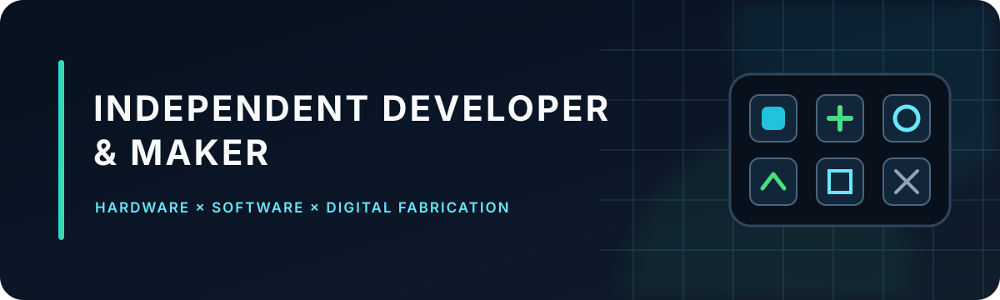

  

  <strong>Building practical products where software meets the physical world.</strong>

  
  
  

## About me

I am a French **developer and maker** who turns practical ideas into working products.

My work sits at the intersection of **web development**, **connected hardware**, **automation** and **digital fabrication**. I enjoy understanding how systems communicate, creating clear interfaces around them, and validating every idea on real hardware.

<table>
  <tr>
    <td width="33%" valign="top">
      <h3>Hardware</h3>
      Connected devices, physical interfaces and useful integrations built around real machines.
    </td>
    <td width="33%" valign="top">
      <h3>Software</h3>
      Web applications, developer tools and interfaces designed around practical workflows.
    </td>
    <td width="33%" valign="top">
      <h3>Fabrication</h3>
      3D-modelled workshop tools, prototyped, printed and refined through real-world testing.
    </td>
  </tr>
</table>

## Technologies & tools

  

  
  
  
  
  

## Selected public work

  
  

  
  

## GitHub activity

  
  

## How I work

> **Real problem → working prototype → hardware testing → polished product**

I prefer useful, tested solutions over theoretical demonstrations. Each project begins with a concrete need and evolves through building, testing and refinement.

---

  <strong>Interested in practical software, hardware integrations or digital fabrication?</strong>  
  <a href="https://www.linkedin.com/in/romain-colard/">Connect on LinkedIn</a>
  &nbsp;•&nbsp;
  <a href="https://github.com/rmncld?tab=repositories">Explore my repositories</a>

