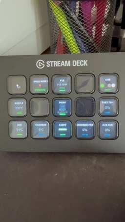

# Romain Colard

Independent developer and maker building practical integrations between hardware, software, and digital fabrication.

## Featured project — BambuDeck

**BambuDeck** is an Elgato Stream Deck plugin built and tested with a **Bambu Lab P1S Combo + AMS**. It turns live printer data into a compact physical dashboard directly on Stream Deck.

  

### Current capabilities

- Printer connection and live operating status
- Print progress and estimated remaining time
- Nozzle, bed, and chamber temperatures
- Part, auxiliary, and chamber fan speeds
- Active speed mode
- AMS filament colors and active slot
- Chamber light ON/OFF

The current submission is intentionally **monitoring-first**: printer telemetry is read locally, and the chamber light is the only direct control included.

### Implementation

- TypeScript
- Elgato Stream Deck SDK
- Local MQTT communication
- Real-time state synchronization
- Dynamic SVG key interfaces
- Tested on Windows with Stream Deck MK.2

### Project status

BambuDeck is complete, working on real hardware, and has been **submitted to the Elgato Marketplace for review**. A full real-world demonstration video is available and shows the Stream Deck updating directly from the printer.

## Snapmaker U1 integration concept

The next objective is to apply the same proven Stream Deck approach to the **Snapmaker U1**.

The concept focuses on a dedicated physical interface for:

- Four independent toolheads
- Per-toolhead state, temperature, and material information
- Print status, progress, and remaining time
- Fast access to the most useful monitoring data
- A clean interface designed specifically for the U1 workflow

The implementation would be explored around the U1 software ecosystem, including **Klipper, Moonraker, and Fluidd**, while respecting the interfaces and safety constraints available on the production machine.

A U1 is required to develop, validate, and demonstrate this integration on real hardware.

## About

I design projects that solve real workshop problems first, then turn the successful prototypes into polished tools for other users.

- [GitHub profile](https://github.com/rmncld)
- [LinkedIn](https://www.linkedin.com/in/romain-colard/)

---

BambuDeck is an independent project and is not affiliated with Bambu Lab or Elgato.
